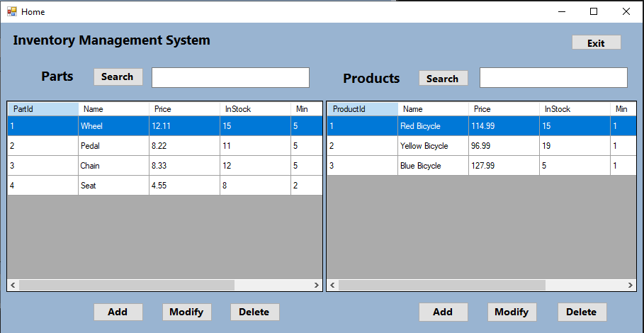

# Inventory Management System (IMS)

A desktop application built using C# and Windows Forms, designed to facilitate efficient inventory management. IMS allows users to manage products and parts, including categorization and search functionalities, making it ideal for small-scale inventory tracking, educational purposes, or as a prototype for more complex systems.

## Features

- **Product and Part Management**: Easily add, modify, and delete products and parts. Products can be associated with multiple parts, supporting complex inventory scenarios.
- **Categorization of Parts**: Parts can be classified as either 'In-house' or 'Outsourced', offering clear distinction in sourcing and organization.
- **In-memory Data Storage**: All data is managed in memory, providing a fast and responsive application for small datasets. Note that data is not persisted after the application is closed.
- **Data Validation and Error Handling**: Ensures data integrity with comprehensive validation and error handling during input and editing processes.
- **Search Functionality**: Quickly locate specific products or parts with a built-in search feature, enhancing user experience and efficiency.
- **User-Friendly Interface**: Designed with simplicity and ease of use, making it accessible for users with varying technical expertise.

## Technologies Used

- **C#**: Main programming language for application logic and UI.
- **Windows Forms**: Framework for building the desktop user interface.
- **In-Memory Storage**: All data is temporarily stored during the application's runtime.

## Screenshot

